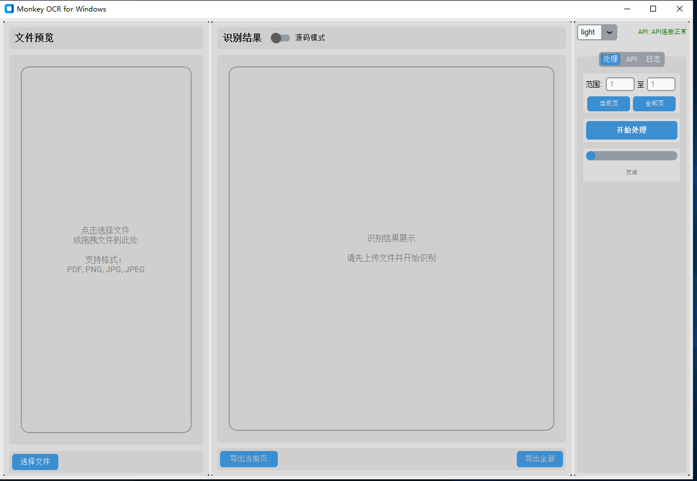
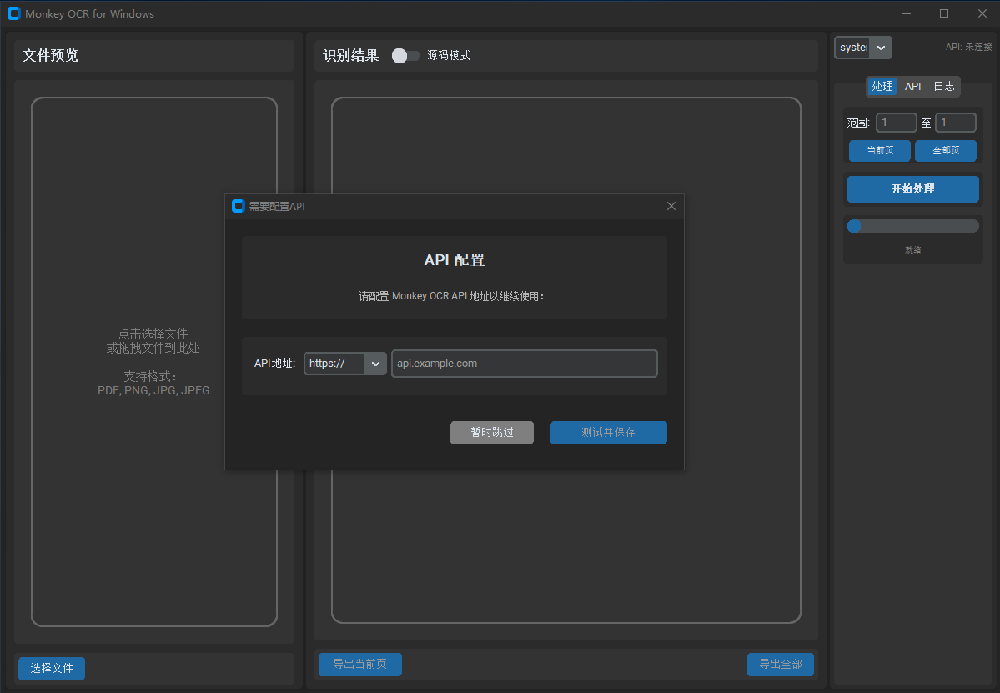
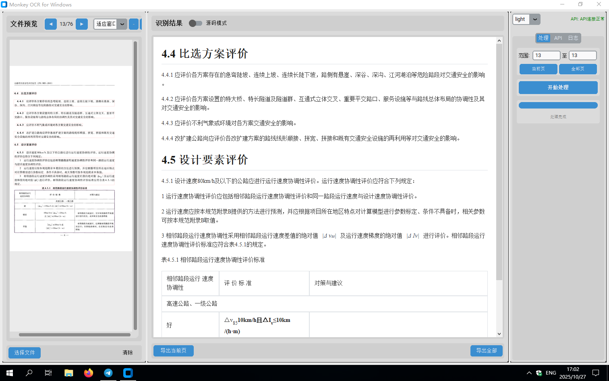
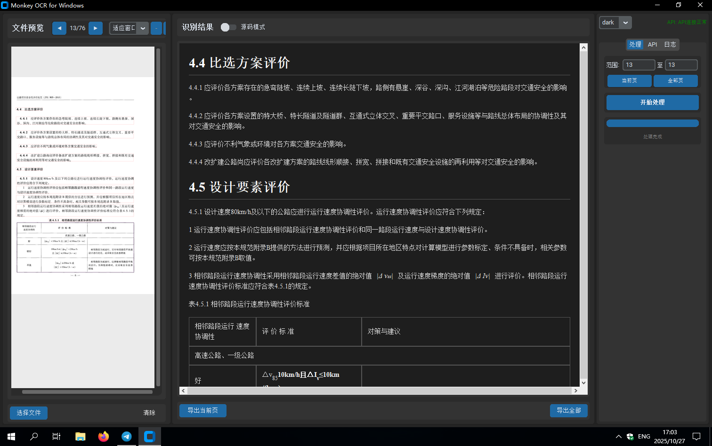

# Monkey OCR GUI

<div align="center">


[English](README.md) | 简体中文

</div>

---

## 📖 项目简介

Monkey OCR GUI 是一个基于 Monkey OCR API 的跨平台图形化工具，旨在提供简洁、高效、易用的 OCR 操作界面。该工具支持文本识别、公式提取、表格解析和完整文档识别，具备多线程并发处理、实时进度跟踪、结果预览和导出等强大功能。

### 核心特性

- 🎯 **多模式识别**：支持文本、公式（LaTeX）、表格（HTML）、文档（Markdown）四种识别模式
- 📄 **多格式支持**：支持 PDF、PNG、JPG、JPEG 格式文件
- 🔄 **页面导航**：PDF 多页文件支持页面浏览和选择性处理
- ⚡ **高性能处理**：智能多线程并发处理，自动根据系统负载调整线程数
- 📊 **实时进度**：实时进度条和详细日志输出
- 🎨 **双模式显示**：支持预览模式和源码模式切换查看结果
- 💾 **灵活导出**：支持单页或全部页面导出
- 🌐 **API 管理**：内置 API 健康检查和连接测试
- 🎭 **主题切换**：支持深色/浅色/跟随系统主题
- 🌍 **国际化**：中英文界面切换支持
- 📝 **标记 PDF**：自动加载和显示 API 返回的标记 PDF

## 📸 产品截图

### 界面展示

<div align="center">

**浅色主题**



**深色主题**



</div>

### OCR 识别

<div align="center">

**浅色主题 OCR**



**深色主题 OCR**



</div>

## 🚀 安装指南

### 系统要求

- **操作系统**：Windows 10+, macOS 10.14+, Linux
- **Python 版本**：3.11 或更高
- **内存**：建议 4GB 以上
- **磁盘空间**：至少 500MB 可用空间

### 依赖安装

1. **克隆仓库**

```bash
git clone https://github.com/yourusername/Dev-Monkey-OCR-GUI.git
cd Dev-Monkey-OCR-GUI
```

2. **安装依赖**

```bash
pip install -r requirements.txt
```

主要依赖包括：
- `customtkinter` - 现代化 GUI 框架
- `PyMuPDF` - PDF 处理
- `Pillow` - 图像处理
- `requests` - HTTP 请求
- `markdown2` - Markdown 渲染
- `matplotlib` - LaTeX 渲染支持

3. **运行应用**

```bash
python main.py
```

## 📋 使用说明

### 首次启动

1. **API 配置**
   - 首次启动会提示配置 API 地址
   - 输入 Monkey OCR API 的基础 URL（例如：`http://localhost:8000`）
   - 点击"测试"按钮验证连接

2. **上传文件**
   - 点击左侧面板的"选择文件"按钮
   - 或直接拖拽文件到上传区域
   - 支持格式：PDF, PNG, JPG, JPEG

3. **选择处理范围**
   - **处理当前页**：仅处理当前显示的页面
   - **处理所有页**：处理文件的所有页面
   - **自定义范围**：在页面范围输入框中指定（如 1-5）

4. **开始识别**
   - 选择识别模式（文本/公式/表格/文档）
   - 点击"开始处理"按钮
   - 查看右侧面板的实时进度和日志

5. **查看结果**
   - 中间面板显示识别结果
   - **预览模式**：渲染后的效果（Markdown/LaTeX/HTML）
   - **源码模式**：原始代码内容
   - 使用页面导航按钮切换不同页面的结果

6. **导出结果**
   - **导出当前页**：导出当前查看页面的结果
   - **导出全部**：批量导出所有已识别页面的结果

### 识别模式说明

| 模式 | 输出格式 | 适用场景 |
|------|----------|----------|
| 文本识别 | Markdown | 纯文本内容、文章段落 |
| 公式提取 | LaTeX | 数学公式、科学论文 |
| 表格提取 | HTML | 表格数据、统计报表 |
| 文档解析 | Markdown + 标记PDF | 完整文档、混合内容 |

### 功能面板

#### 左侧面板 - 文件管理
- 文件上传和预览
- PDF 页面导航
- 标记 PDF 加载和对比

#### 中间面板 - 结果显示
- 双模式切换（预览/源码）
- 页面结果导航
- 内容复制和导出

#### 右侧面板 - 控制中心
- API 配置和状态
- 页面选择控制
- 处理进度跟踪
- 实时日志输出

## ⚙️ 配置说明

### API 配置

在右侧面板"API 配置"区域：
- **API 地址**：Monkey OCR API 的基础 URL
- **测试按钮**：验证 API 连接状态
- **状态指示**：显示当前连接状态（健康/错误/未测试）

### 性能调优

应用会自动检测系统资源并优化并发性能：
- **CPU 负载** > 80%：减少 50% 线程数
- **可用内存** < 1GB：减少 50% 线程数
- **可用内存** < 2GB：减少 25% 线程数

可以通过修改 `src/config/settings.py` 调整默认配置：

```python
"performance": {
    "concurrency": {
        "ocr_processing": 4,
        "min_workers": 2,
        "max_workers": 16
    }
}
```

### 主题设置

右侧面板底部提供主题切换：
- **跟随系统**：自动适配系统主题
- **深色模式**：深色界面
- **浅色模式**：浅色界面

## 🛠️ 开发指南

### 项目结构

```
Dev-Monkey-OCR-GUI/
├── main.py                 # 应用入口
├── requirements.txt        # 依赖列表
├── version.json           # 版本信息
├── src/
│   ├── api/              # API 客户端
│   │   └── monkey_ocr_client.py
│   ├── config/           # 配置管理
│   │   └── settings.py
│   ├── gui/              # GUI 组件
│   │   ├── main_window.py
│   │   ├── panels/       # 面板组件
│   │   ├── dialogs/      # 对话框
│   │   ├── renderers/    # 内容渲染器
│   │   └── styles/       # 样式定义
│   └── utils/            # 工具函数
│       ├── file_utils.py
│       └── i18n.py
└── locales/              # 国际化资源
    ├── zh_CN.json
    └── en_US.json
```

### 从源码构建

使用 PyInstaller 打包为独立可执行文件：

```bash
pyinstaller monkey_ocr.spec
```

生成的可执行文件位于 `dist/` 目录。

### 技术亮点

#### 1. 智能并发控制
- 自动检测系统 CPU 和内存状态
- 动态调整工作线程数
- 避免系统过载

#### 2. 连接池管理
- HTTP 连接池复用
- 减少连接建立开销
- 提升并发性能

#### 3. 重试机制
- 自动重试网络错误
- 指数退避策略
- 最多重试 3 次

#### 4. 错误处理
- 细粒度异常分类
- 详细错误日志
- 用户友好提示

#### 5. 资源管理
- 自动清理临时文件
- 启动时清理过期缓存
- 退出时清理所有临时资源

## ❓ 常见问题

### Q1: API 连接失败怎么办？
**A**: 检查以下几点：
1. 确认 API 服务已启动
2. 检查 URL 格式是否正确（如 `http://localhost:8000`）
3. 确认防火墙未阻止连接
4. 查看日志输出获取详细错误信息

### Q2: 为什么处理速度慢？
**A**: 可能的原因：
1. 网络延迟较高
2. 系统资源不足（CPU/内存）
3. 处理大文件或大量页面
4. API 服务器负载高

尝试：
- 减少并发页面数
- 分批处理大文件
- 升级系统硬件

### Q3: 支持哪些文件格式？
**A**: 当前支持：
- **图像**：PNG, JPG, JPEG
- **文档**：PDF（多页支持）

### Q4: 如何修改界面语言？
**A**: 应用会自动检测系统语言。可以通过修改配置文件手动切换：
```python
"ui": {
    "language": "zh_CN"  # 或 "en_US"
}
```

### Q5: 导出的文件保存在哪里？
**A**: 导出时会弹出文件选择对话框，可以自由选择保存位置。

### Q6: 如何更新到最新版本？
**A**:
```bash
git pull origin main
pip install -r requirements.txt --upgrade
```

## 📄 许可证

本项目采用 [MIT 许可证](LICENSE)。

## 🙏 致谢

- [Monkey OCR](https://github.com/Yuliang-Liu/MonkeyOCR) - 使用结构-识别-关系三元组范式进行文档解析
- [CustomTkinter](https://github.com/TomSchimansky/CustomTkinter) - 现代化 Tkinter 界面库
- [PyMuPDF](https://github.com/pymupdf/PyMuPDF) - 高性能 PDF 处理库
